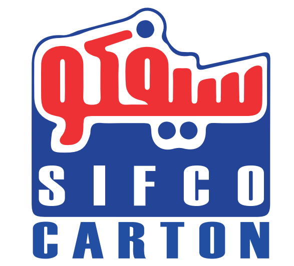
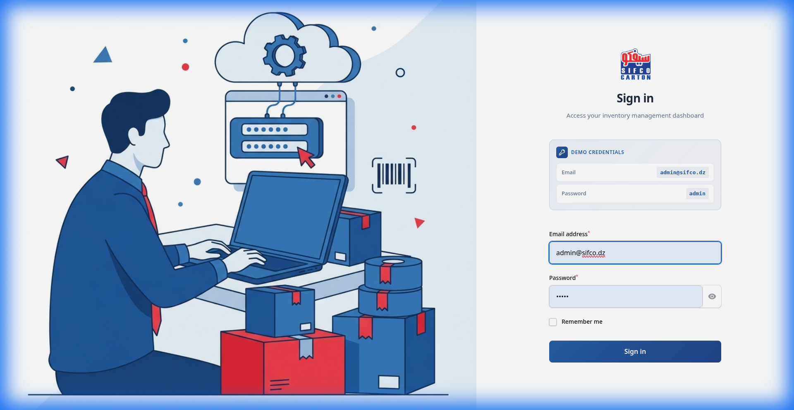
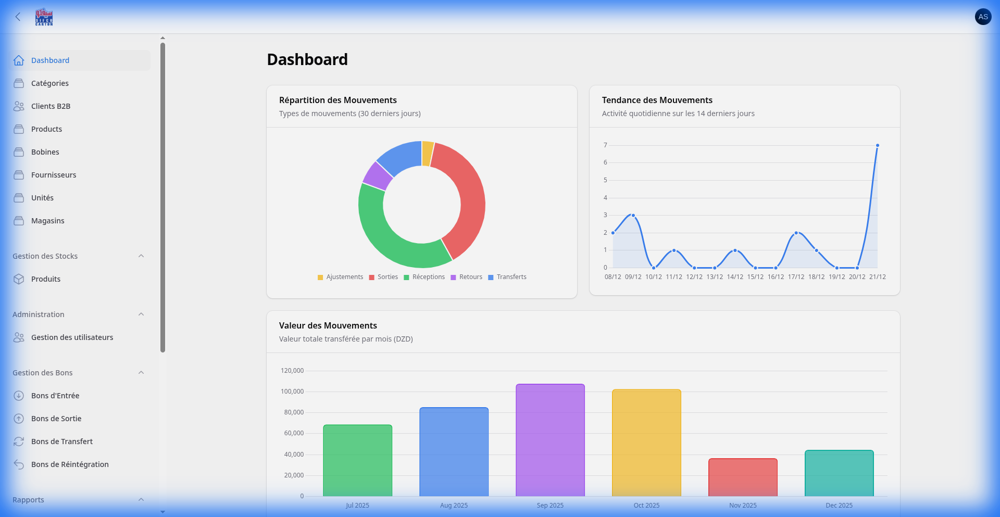
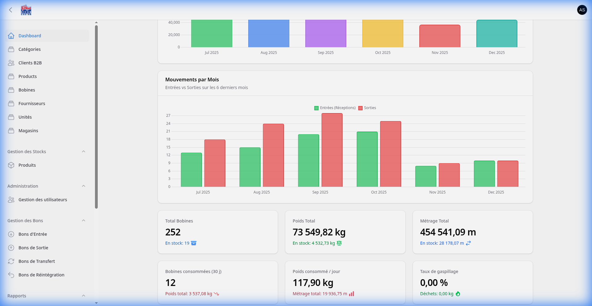
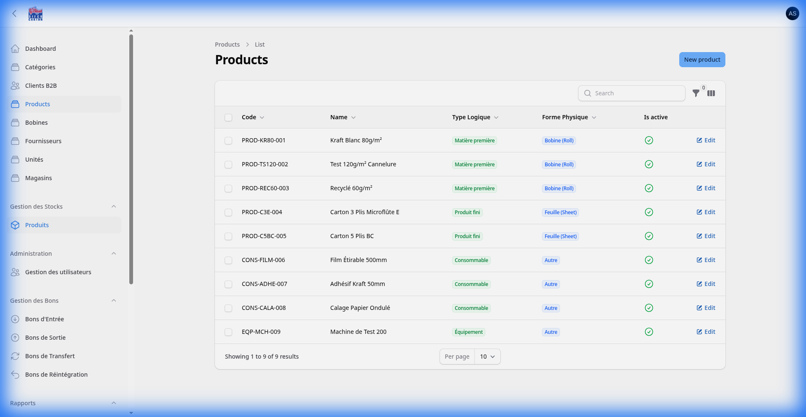
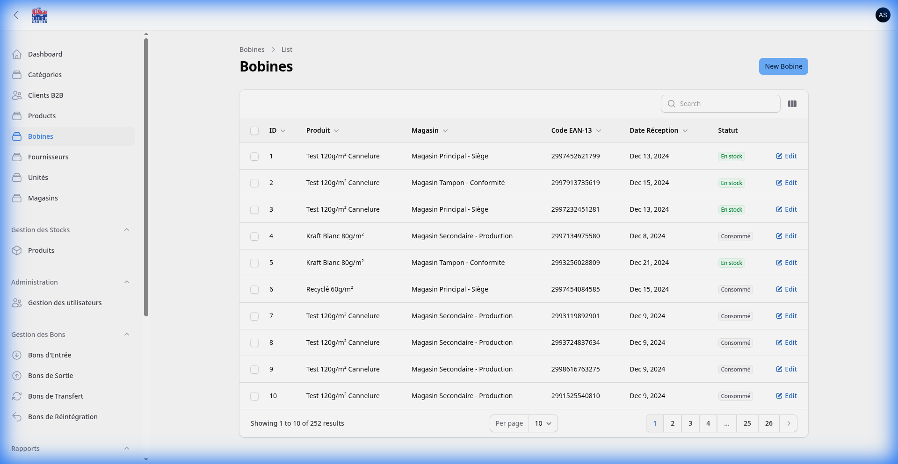
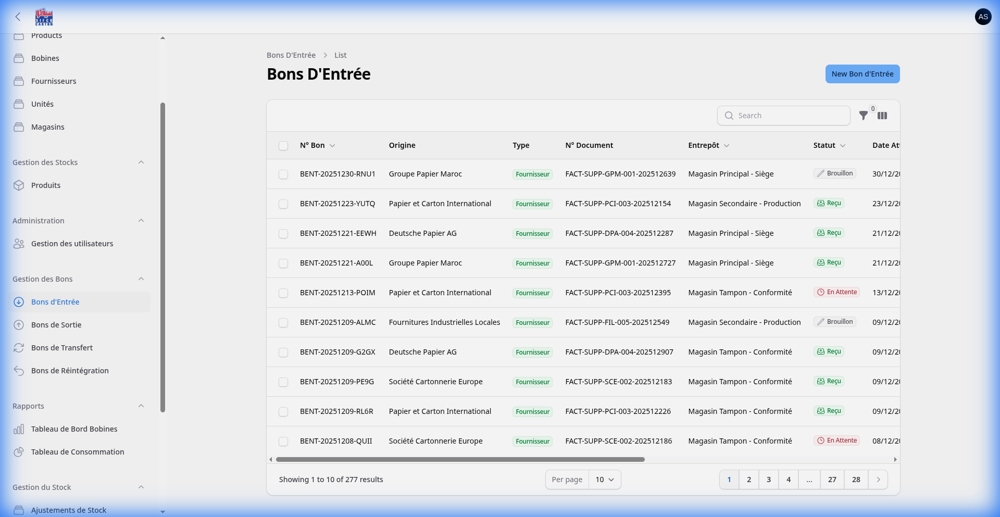
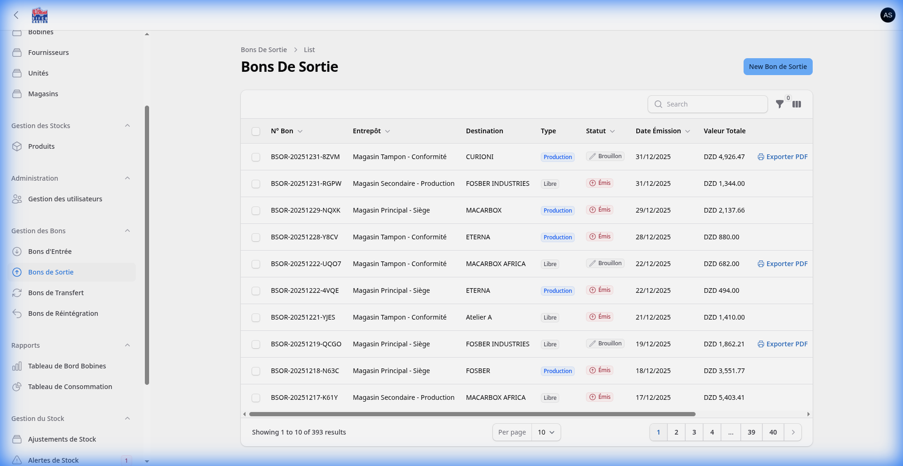
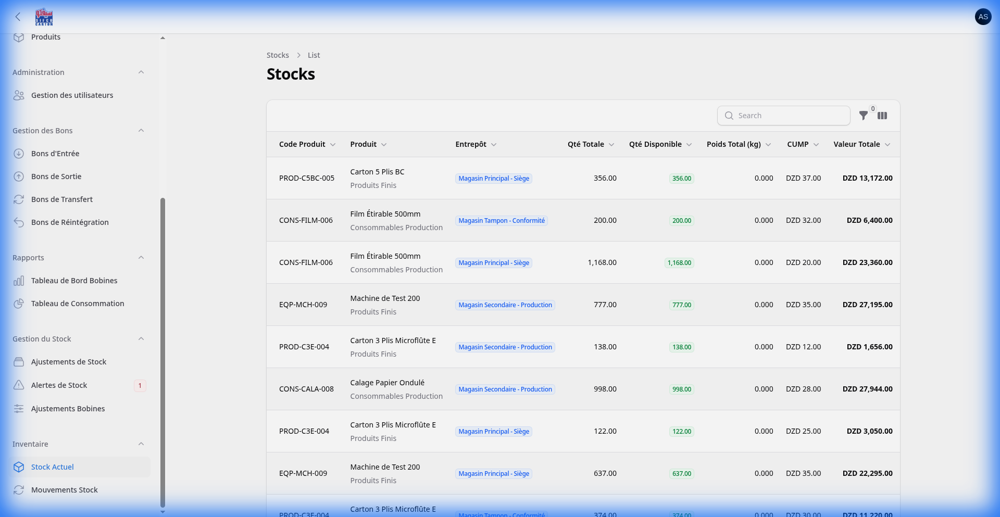
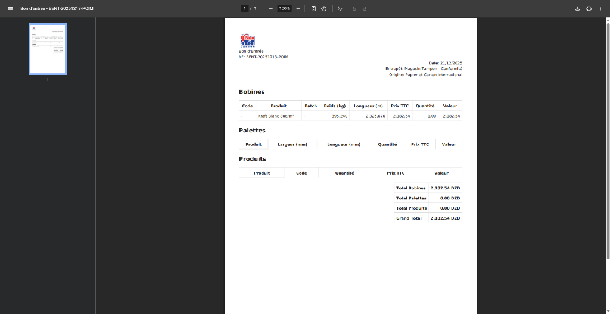

<p align="center">
  
</p>

<h1 align="center">SIFCO-Inv</h1>

<p align="center">
  <strong>Comprehensive Inventory Management System for Carton Manufacturing</strong>
</p>

<p align="center">
  <a href="#features">Features</a> •
  <a href="#screenshots">Screenshots</a> •
  <a href="#tech-stack">Tech Stack</a> •
  <a href="#installation">Installation</a> •
  <a href="#license">License</a>
</p>

<p align="center">
  
  
  
  
</p>

---

## 📋 Overview

**SIFCO-Inv** is a full-featured inventory and stock management system designed specifically for **SIFCO Carton**, a cardboard manufacturing company. The system provides end-to-end traceability from raw material receipt to finished goods dispatch, with integrated production line tracking.

### Key Highlights

- 🏭 **Production-Integrated Workflow** — Track materials from suppliers through production lines to customers
- 📊 **Real-Time Analytics** — Comprehensive dashboard with movement trends, value tracking, and consumption metrics
- 📄 **PDF Document Generation** — Professional Bon d'Entrée, Bon de Sortie, and transfer documents
- 🎯 **Multi-Warehouse Support** — Manage stock across Siège, Production, and Conformité warehouses
- 📦 **Roll & Product Tracking** — Full lifecycle management for paper rolls with weight, length, and consumption metrics

---

## ✨ Features

### Inventory Management
| Feature | Description |
|---------|-------------|
| **Products Catalog** | Manage raw materials, semi-finished goods, finished products, and consumables |
| **Bobines (Rolls)** | Track paper rolls with EAN codes, weight (kg), length (m), and status |
| **Stock Quantities** | Real-time stock levels across multiple warehouses with CUMP valuation |
| **Low Stock Alerts** | Automated alerts when inventory falls below threshold |

### Document Management (Bons)
| Document | Purpose |
|----------|---------|
| **Bon d'Entrée** | Goods receipt from suppliers or production lines |
| **Bon de Sortie** | Goods issue to production lines or B2B clients |
| **Bon de Transfert** | Inter-warehouse transfers |
| **Bon de Réintégration** | Return goods to stock |

### Production Integration
- Polymorphic relationships linking receipts and issues to production lines (Fosber, Macarbox, Eterna, Curioni)
- Track raw material consumption per production line
- Monitor finished goods output by line

### Analytics Dashboard
- **Movement Distribution** — Pie chart of transaction types (30 days)
- **Daily Trend** — Line chart of daily activity (14 days)
- **Monthly Value** — Bar chart of transferred value (6 months)
- **Consumption Stats** — Rolls consumed, daily consumption rate, waste rate

---

## 📸 Screenshots

### Login Page
Modern split-screen login with demo credentials display.



### Dashboard
Real-time analytics with movement charts and key metrics.





### Products Management
Complete product catalog with categories, types, and specifications.



### Bobines (Rolls) Management
Track paper rolls with EAN codes, weight, length, and status.



### Goods Receipt (Bon d'Entrée)
Record incoming shipments from suppliers or production lines.



### Goods Issue (Bon de Sortie)
Track outgoing materials to production or customers.



### Stock Quantities
Real-time inventory levels with value tracking.



### PDF Document Generation
Professional documents with company branding.



---

## 🛠 Tech Stack

### Backend
- **Framework:** Laravel 12.x
- **Admin Panel:** Filament 4.x
- **Database:** Azure SQL Server
- **Authentication:** Laravel Sanctum

### Frontend
- **CSS Framework:** Tailwind CSS 4.x
- **Build Tool:** Vite
- **Components:** Blade + Alpine.js

### Infrastructure
- **Containerization:** Docker + Docker Compose
- **Web Server:** Nginx
- **PHP Version:** 8.2+

### Key Packages
| Package | Purpose |
|---------|---------|
| `filament/filament` | Admin panel framework |
| `barryvdh/laravel-dompdf` | PDF generation |
| `alperenersoy/filament-export` | Data export functionality |
| `diogogpinto/filament-auth-ui-enhancer` | Custom login UI |

---

## 🚀 Installation

### Prerequisites
- Docker & Docker Compose
- Git

### Quick Start

```bash
# Clone the repository
git clone https://github.com/blamairia/sifco-inv.git
cd sifco-inv

# Copy environment file
cp .env.example .env

# Start with Docker
docker compose up -d --build

# Access the application
open http://localhost:9001/admin
```

### Demo Credentials
| Email | Password |
|-------|----------|
| `admin@sifco.dz` | `admin` |

---

## 📁 Project Structure

```
sifco-inv/
├── app/
│   ├── Filament/
│   │   ├── Auth/           # Custom login page
│   │   ├── Resources/      # 18 CRUD resources
│   │   └── Widgets/        # Dashboard widgets
│   ├── Models/             # 31 Eloquent models
│   └── Services/           # Business logic services
├── database/
│   └── migrations/         # Database schema
├── resources/
│   ├── css/                # Tailwind styles
│   └── views/              # Blade templates
├── public/
│   └── build/              # Compiled assets
├── docker-compose.yml      # Container orchestration
└── Dockerfile              # Container definition
```

---

## 📊 Data Models

### Core Entities
- **Product** — Items with types (roll, consumable, finished)
- **Roll** — Paper roll with lifecycle tracking
- **StockQuantity** — Warehouse inventory levels
- **StockMovement** — Transaction history

### Document Models
- **BonEntree** — Goods receipt with polymorphic source
- **BonSortie** — Goods issue with polymorphic destination
- **BonTransfert** — Inter-warehouse transfers
- **BonReintegration** — Stock returns

### Supporting Entities
- Category, Supplier, Client, Warehouse, Unit, ProductionLine

---

## 🎨 Design Features

- **Collapsible Sidebar** — More screen real estate on desktop
- **Custom Color Scheme** — SIFCO brand colors (Primary: #265DA6)
- **Responsive Design** — Works on desktop and tablet
- **Modern Login** — Split-screen with background image

---

## 📝 License

This project is proprietary software developed for **SIFCO Carton**.

---

## 👤 Author

**Billel Lamairia**  
Backend & DevOps Engineer

- Portfolio: [blamairia.dev](https://blamairia.dev)
- GitHub: [@blamairia](https://github.com/blamairia)
- LinkedIn: [Billel Lamairia](https://linkedin.com/in/blamairia)

---

<p align="center">
  Built with ❤️ using Laravel & Filament
</p>
